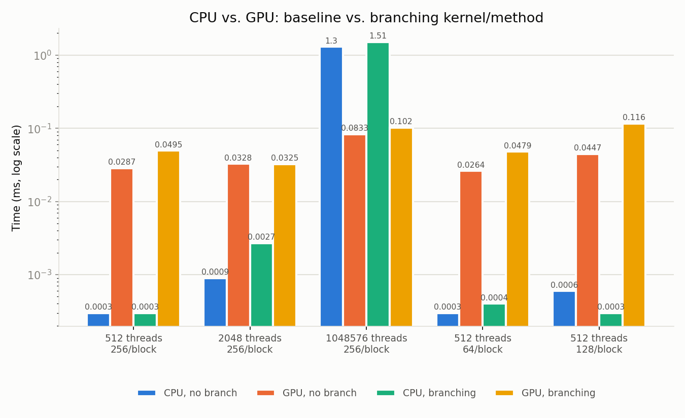

## Cover Sheet

**Name:** Nolan Pye
**Assignment:** EN605.617 – Introduction to GPU Programming, Module 3 — CUDA Threads and Blocks

---

## Problem 1 — CPU vs. GPU Baseline

**Problem statement.** Implement the same (or a similar) algorithm as a
CPU-based method and a CUDA kernel, with minimal conditional branching in
each, over a non-trivial amount of data (thousands to millions of
elements).

**Assumptions.** Single-precision floats; input data is generated
deterministically (`a[i] = i * 0.5`, `b[i] = (n - i) * 0.25`) so every run
compares the CPU and GPU against identical inputs. GPU time is measured
with `cudaEvent` around the kernel launch only (H2D/D2H copies excluded),
after one throwaway warm-up launch so the one-time CUDA context/driver
cost isn't charged to whichever kernel happens to run first. CPU time is
a monotonic wall-clock measurement around the function call.

**Computations.** `c[i] = a[i]*b[i] + a[i]`, computed identically by
`cpuBaseline()` and `gpuBaselineKernel()` in `assignment.cu` — zero
conditional branches in either. Run at 512, 2,048, and 1,048,576 elements
(Table 1, all rows, "no branch" columns).

**Conclusions / discussion.** The GPU only pays off once there's enough
work to amortize its fixed per-launch overhead: the CPU beats the GPU at
512–2,048 elements, but at 1,048,576 elements the GPU is ~15.5x faster
(0.083 ms vs. 1.30 ms) as thousands of threads run the arithmetic
genuinely in parallel. See Figure 1.

---

## Problem 2 — Effect of Conditional Branching

**Problem statement.** Extend the same CPU method and GPU kernel with at
least one conditional branch each, and evaluate the performance effect.

**Assumptions.** The branch condition is index parity (`i % 2`) —
deliberately the worst case for a GPU, since it splits every 32-thread
warp exactly 50/50, forcing the hardware to execute both branch paths
serially for every warp in the grid.

**Computations.** `cpuBranching()` and `gpuBranchingKernel()` in
`assignment.cu`, run at the same five thread-count/block-size
configurations as Problem 1 (Table 1, "branching" columns).

**Conclusions / discussion.** The branch slows the GPU down in 4 of the 5
runs (roughly 1.2x–2.6x versus its own no-branch baseline) — that's warp
divergence; the one exception (2,048 threads) landed within measurement
noise of its baseline. On the CPU, branching time stays close to the
no-branch baseline across the board — a CPU core has branch prediction
and only one instruction stream, so an alternating branch costs
essentially nothing, unlike the GPU's more consistent divergence penalty.
That asymmetry is the intended result of this part of the assignment.

### Figure 1 — CPU vs. GPU timing, baseline vs. branching

*Figure 1. Wall-clock time (log scale, milliseconds) for the CPU and GPU
baseline and branching variants across five thread-count/block-size
configurations. Raw data in Table 1 / `results.csv`; generated by
`plot_results.py`.*

### Table 1 — Raw timing results

| Total threads | Block size | CPU, no branch (ms) | GPU, no branch (ms) | CPU, branching (ms) | GPU, branching (ms) |
|--:|--:|--:|--:|--:|--:|
| 512 | 256 | 0.0003 | 0.0287 | 0.0003 | 0.0495 |
| 2,048 | 256 | 0.0009 | 0.0328 | 0.0027 | 0.0325 |
| 1,048,576 | 256 | 1.2954 | 0.0833 | 1.5132 | 0.1023 |
| 512 | 64 | 0.0003 | 0.0264 | 0.0004 | 0.0479 |
| 512 | 128 | 0.0006 | 0.0447 | 0.0003 | 0.1163 |

*Table 1. Raw wall-clock timings for each configuration, as recorded in
`results.csv` by `assignment.exe`. Hardware: NVIDIA GeForce GTX 1650 Ti.
Note: at 1,048,576 elements, the GPU baseline result differs from the
CPU's by up to 4,096 in raw value (reported by the program's own
correctness check) — this is `nvcc` fusing the multiply-add into a single
FMA instruction on the GPU while the host does two separately-rounded
operations; expected floating-point non-associativity at large
magnitudes, not a bug.*

---

## Stretch Problem — Critique of a Prior-Year `main()`

**Problem statement.** Given a prior-year submission's `main()` (CPU/GPU
add over arrays `a`, `b`, `c`, with `chrono`-based timing around the
kernel launch and the CPU function), and assuming the surrounding script
executes `main` exactly once, identify what is good and bad about it. Per
the assignment instructions, this is a discussion only — no fixed version
of that code is submitted alongside this assignment.

**Discussion.**

*Good:* CLI parsing is flexible (`argc == 2` overrides just `blocks`,
`argc == 3` overrides both `blocks` and `threads`) and prints what
changed. The H2D → kernel → D2H → `cudaFree` data flow is correct, with
no device-memory leak. The CPU and GPU sides run the same algorithm over
the same data, which is the right comparison to make.

*Bad:* The GPU timing is essentially meaningless — a kernel launch is
asynchronous, so `stop` is captured almost immediately after the
non-blocking launch call returns, before the device has actually
finished. The real kernel time ends up hidden inside the untimed,
blocking `cudaMemcpy` that follows. There's also no validation that
`blocks * threads == N`, so a launch configuration could leave part of
`c` uninitialized or (if the kernel has no bounds check) write past the
end of the device buffers; no CUDA error checking on any API call, so a
failure would silently produce wrong output; and the default `blocks = 3`
/ `threads = 64` are magic numbers rather than named constants.
