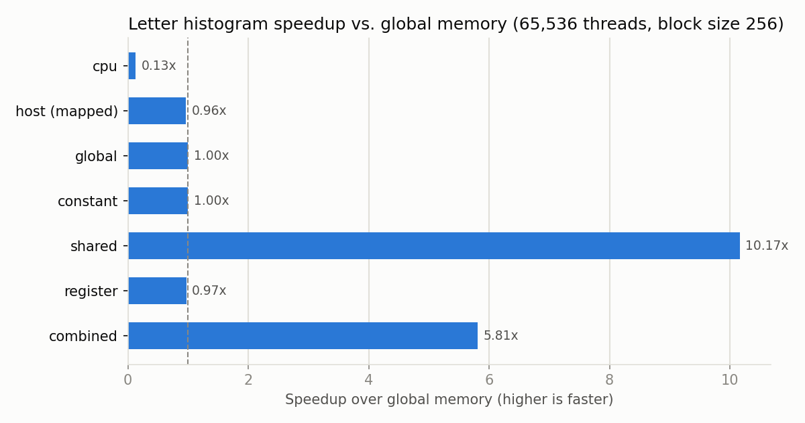
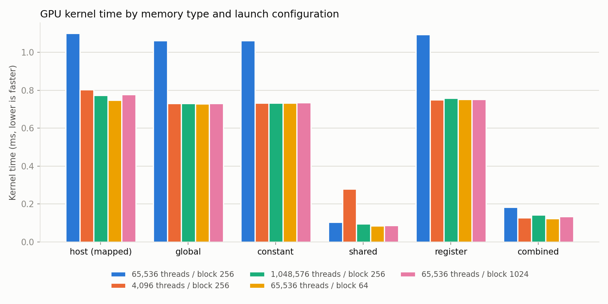

## Cover Sheet

**Name:** Nolan Pye
**Assignment:** EN605.617 – Introduction to GPU Programming, Module 5 — CUDA Memory

---

## What the program does

It counts how often each letter a–z appears in *War and Peace*
(3.34 MB of text, 2,506,248 letters). The same counting code runs once per
CUDA memory type; only *where* the data lives changes, so the timings
compare memory types fairly.

For each byte, a thread looks it up in a 256-entry table (letter → bin)
and adds 1 to that letter's count with `atomicAdd`.

| Version | What lives where |
|---------|------------------|
| cpu | Everything in host memory (the reference answer) |
| host (mapped) | GPU reads the text directly from pinned host RAM |
| global | Text, table, and counts in global memory (the baseline) |
| constant | Lookup table moved to constant memory |
| shared | Each block keeps its own counts in shared memory, merged at the end |
| register | Text read 16 bytes at a time into registers |
| combined | Registers + constant table + shared counts in one kernel |

Every GPU version matched the CPU counts exactly in all 5 runs.

---

## Results



*Figure 1. Speedup over global memory at 65,536 threads, block size 256.*



*Figure 2. Kernel time for each memory type across all five runs
(lower is faster).*

### Key takeaways

- **Shared memory wins: 8–10x faster than global** (except at 4,096
  threads; see below). With only 26
  counters, millions of threads queue up to update the same few global
  addresses. Giving each block its own counters in shared memory removes
  that traffic jam.
- **Constant and register made no difference on their own (~1x).** They
  make *reading* faster, but reading wasn't the bottleneck — the queue on
  the global counters was.
- **Combined was 5–6x faster, and the most consistent.** It was the
  fastest at 4,096 threads, but slower than shared alone elsewhere.
  Constant memory is fastest when all threads read the *same* entry; here
  each thread looks up a different letter, so those reads take turns.
- **Host (mapped) was only slightly slower than global (2–10%).** The
  slow PCIe reads were hidden behind the same counter traffic jam.
- **Pinned host memory copied 11–19% faster than pageable** (≈6.2 vs.
  ≈5.3 GB/s).
- **The GPU beat the CPU by 7.5x (slowest version) to ~98x (shared).**

### Effect of thread count and block size

- **Thread count:** most versions took ~0.73 ms regardless of thread
  count, because the counter queue limits them. The exception is shared
  at 4,096 threads (0.28 ms vs. ~0.09 ms): 16 blocks on 16 SMs is one
  block per SM, too few warps to hide memory delays. Combined avoided
  this because each 16-byte register load means 16x fewer reads to wait on.
- **Block size:** 64 vs. 1024 threads per block made almost no
  difference (shared: 0.086 vs. 0.087 ms).

### Timing table (ms, average of 20 runs)

| Threads | Block | cpu | host | global | constant | shared | register | combined |
|--:|--:|--:|--:|--:|--:|--:|--:|--:|
| 65,536 | 256 | 8.306 | 1.101 | 1.062 | 1.063 | 0.104 | 1.094 | 0.183 |
| 4,096 | 256 | 8.239 | 0.803 | 0.732 | 0.732 | 0.281 | 0.751 | 0.128 |
| 1,048,576 | 256 | 8.506 | 0.773 | 0.732 | 0.733 | 0.095 | 0.759 | 0.143 |
| 65,536 | 64 | 8.478 | 0.748 | 0.730 | 0.732 | 0.086 | 0.751 | 0.125 |
| 65,536 | 1024 | 8.494 | 0.777 | 0.731 | 0.735 | 0.087 | 0.752 | 0.134 |

*Note: the first row is slower for most GPU versions because it ran first,
while the laptop GPU was still raising its clock speed. Comparisons
within a row are still fair.*

---

## Build and run

```bash
./build.sh                                  # build
./run.sh                                    # all five runs
./run.sh <totalThreads> <blockSize> [file]  # one run
```

Hardware: NVIDIA GeForce GTX 1650 Ti (16 SMs).
